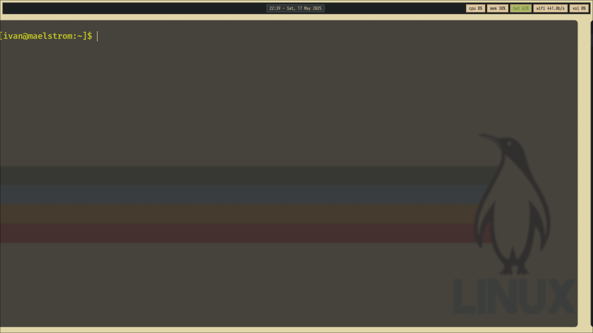

# NIX-OS
Configuración personal de NixOS considerando dos hosts: notebook y pc.
### Maelstrom
Correspondiente a la notebook, gestionado por Home-Manager como módulo y Stylix para la apariencia uniforme.
- **Gestor de ventana:** Hyprland
- **Terminal:** Kitty
- **Editor:** Neovim
- **Navegador:** Firefox

### Vortex
Correspondiente a la PC. Proximamente =S

# TODO:
- Ver swww para la gestión de fondos
- Ver hyprpanel para reemplazar o complementar con waybar
- Cambiar a Emacs como editor
- Configurar la PC con los drivers correspondientes
