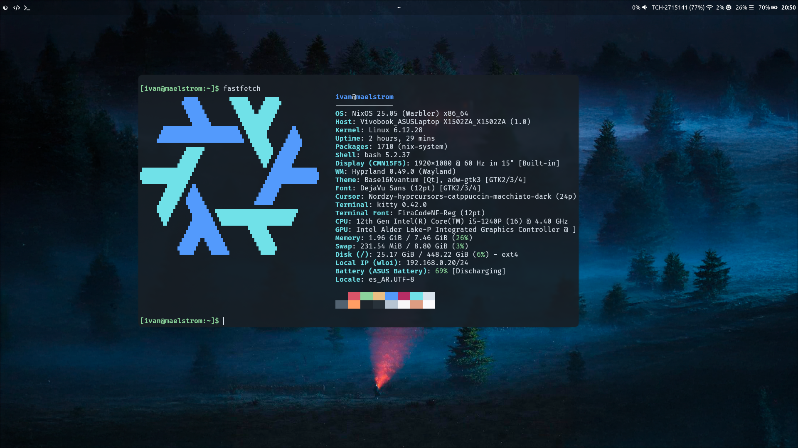
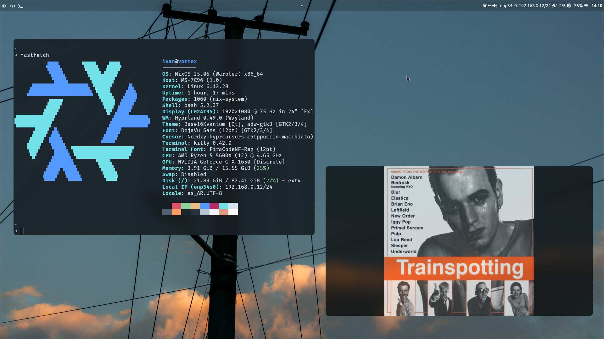

# NIX-OS
Configuración personal de NixOS considerando dos hosts: notebook y pc.
- **Gestor de ventana:** Hyprland
- **Terminal:** Kitty
- **Editor:** Neovim
- **Navegador:** Zen
- **Administrador de archivos:** Nemo
Gestionado de la configuración personal por medio de Home-Manager como módulo y Stylix para la apariencia uniforme.

### Maelstrom

### Vortex

# TO-DO:
- Hacer que swww se ejecute como servicio de systemd
- Arreglar el servicio de swww para que no ejecute el daemon constantemente )?????? ni idea por que pasa
- Blur uniforme en todas las ventanas)?
- Fix iconos (o buscar otro tema directamente)
- Cambiar apariencia starship
